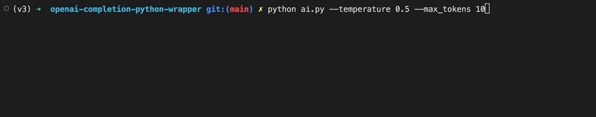

This project wraps OpenAI's completion endpoint in a Python command line application, returning the text with character-by-character streaming for a more organic experience.

## Setup

To run this application, you'll need an API key from your [OpenAI account](https://openai.com/api/). Once you have your API key, create a `.env` file in the root directory containing the key as follows:

```
OPENAI_API_KEY=<your_API_key_here>
```

## Running the application

1. Create a virtual environment, activate it, then install the packages from `requirements.txt` with `pip install -r requirements.txt`.

2. There are two optional flags: `--temperature` ([explained here](https://beta.openai.com/docs/api-reference/completions/create#completions/create-temperature)) and `--max_tokens` which prevents the endpoint from generating too many tokens and increasing the cost.

3. Run the program with `python ai.py` along with any of the optional flags.